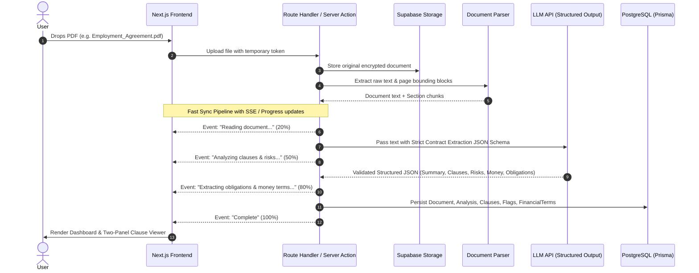

# Signwise — Product Architecture & Implementation Plan

> **"Know what you're agreeing to before you sign."**  
> Plain-English contract analysis, risk detection, obligation mapping, and negotiation intelligence for normal humans.

---

## 1. Executive Summary & Vision

Contracts govern the most consequential decisions of everyday life—employment, housing, freelancing, intellectual property, and financing. Yet over 90% of individuals sign agreements without understanding the restrictive covenants, hidden liabilities, or financial traps buried in legal jargon.

**Signwise** (product concept: *Before You Sign*) is **not** another generic "ChatGPT for PDFs" or raw document Q&A wrapper. It is a focused, opinionated legal translation and decision-support engine designed to answer three visceral human questions:

1. **"What am I actually agreeing to?"** (Plain-English translation)
2. **"What am I giving up and what are the traps?"** (Red flags, IP assignment, restrictive covenants)
3. **"What should I do or ask before signing?"** (Negotiation checklists, HR clarification emails, clause citations)

### Core Product Philosophy
- **Boring Infrastructure, Sophisticated Product:** Zero premature microservices, no Redis/Celery queues for MVP, no complex vector DB clusters. Fast, resilient monolith built on Next.js, PostgreSQL, Supabase, and structured LLM inference.
- **Explain Like I'm a Human:** Never dump raw legal text or generic AI summaries. Translate legal jargon into practical consequences (*"What it says"*, *"What this means"*, *"Why it matters"*, and *"What to ask"*).
- **Grounded & Verifiable:** Every flagged risk and clause explanation links directly to the exact clause and page in the original document viewer.
- **Calm, High-Trust UI:** Avoid alarming red panic badges or sensationalist warnings. Contract review causes anxiety; the UI must feel calm, authoritative, and clear (Linear/Apple aesthetic).
- **Safety First:** Clear separation between educational AI contract comprehension and formal legal advice.

---

## 2. System Architecture

```
                                  ┌───────────────────────────────┐
                                  │      Client Browser (PWA)     │
                                  │  Next.js 14+ App Router, TS   │
                                  │  Tailwind CSS + shadcn/ui     │
                                  └──────────────┬────────────────┘
                                                 │
                                                 │ HTTPS / Server Actions & Route Handlers
                                                 ▼
┌─────────────────────────────────────────────────────────────────────────────────────────────────┐
│                                   Signwise Next.js Core Monolith                                │
│                                                                                                 │
│  ┌────────────────────────┐    ┌──────────────────────────┐    ┌──────────────────────────────┐ │
│  │   Auth Middleware      │    │  Document Ingest & OCR   │    │     AI Analysis Engine       │ │
│  │   (Supabase / Clerk)   │    │  - PDF parsing           │    │  - Document classifier       │ │
│  │   Session validation   │    │  - Text chunking         │    │  - Structured JSON schema    │ │
│  │   Rate-limiting        │    │  - Page/clause indexer   │    │  - Grounding & citation map  │ │
│  └────────────────────────┘    └──────────────────────────┘    └──────────────────────────────┘ │
│                                                │                                                │
│  ┌────────────────────────┐    ┌───────────────┴──────────┐    ┌──────────────────────────────┐ │
│  │   Interactive Q&A      │    │  Negotiation Generator   │    │   Red-Flag / Risk Scorer     │ │
│  │   - Grounded context   │    │  - Counter-proposals     │    │  - Traffic-light assessment  │ │
│  │   - Jump-to-clause     │    │  - HR Email drafts       │    │  - "What am I giving up?"    │ │
│  └────────────────────────┘    └──────────────────────────┘    └──────────────────────────────┘ │
└───────────────────────┬────────────────────────┬──────────────────────────────┬─────────────────┘
                        │                        │                              │
                        ▼                        ▼                              ▼
             ┌─────────────────────┐  ┌─────────────────────┐       ┌───────────────────────┐
             │     PostgreSQL      │  │   Object Storage    │       │     LLM Providers     │
             │   (Supabase/Neon)   │  │ (Supabase S3 bucket)│       │ (Gemini / Anthropic)  │
             │  Prisma / Drizzle   │  │   Encrypted PDFs    │       │ Structured JSON Mode  │
             └─────────────────────┘  └─────────────────────┘       └───────────────────────┘
```

---

## 3. Data Flow & Processing Pipeline



---

## 4. Database Schema (Prisma)

```prisma
datasource db {
  provider = "postgresql"
  url      = env("DATABASE_URL")
}

generator client {
  provider = "prisma-client-js"
}

enum DocumentType {
  EMPLOYMENT
  RENTAL_HOUSING
  FREELANCE_SERVICES
  FINANCIAL_LOAN
  NDA_CONFIDENTIALITY
  CONSUMER_TERMS
  INSURANCE
  EDUCATION
  OTHER
}

enum AnalysisStatus {
  PENDING
  PROCESSING
  COMPLETED
  FAILED
}

enum RiskLevel {
  LOW       // 🟢 Straightforward / Standard
  MEDIUM    // 🟠 Worth Reviewing / Clarify
  HIGH      // 🔴 High Attention / Red Flag
}

enum PartyType {
  USER          // Obligation of the signer
  COUNTERPARTY  // Obligation of employer, landlord, client, etc.
}

model User {
  id            String         @id @default(uuid())
  email         String         @unique
  name          String?
  avatarUrl     String?
  stripeCustId  String?        @unique
  subscriptionTier String      @default("free") // "free" | "plus" | "pro"
  createdAt     DateTime       @default(now())
  updatedAt     DateTime       @updatedAt

  documents     Document[]
  queries       DocumentQuery[]
}

model Document {
  id            String         @id @default(uuid())
  userId        String
  user          User           @relation(fields: [userId], references: [id], onDelete: Cascade)
  
  title         String
  fileName      String
  fileSize      Int
  fileType      String         @default("application/pdf")
  storagePath   String
  documentType  DocumentType   @default(OTHER)
  status        AnalysisStatus @default(PENDING)
  pageCount     Int?           @default(1)
  
  rawText       String?        @db.Text
  createdAt     DateTime       @default(now())
  updatedAt     DateTime       @updatedAt

  analysis      Analysis?
  queries       DocumentQuery[]

  @@index([userId])
}

model Analysis {
  id              String         @id @default(uuid())
  documentId      String         @unique
  document        Document       @relation(fields: [documentId], references: [id], onDelete: Cascade)
  
  overallStatus   RiskLevel      @default(MEDIUM)
  headlineSummary String         @db.Text
  totalItemsCount Int            @default(0)
  reviewCount     Int            @default(0)
  actionCount     Int            @default(0)
  
  whatYouAreGivingUp  String[]   // List of key rights ceded
  
  createdAt       DateTime       @default(now())
  updatedAt       DateTime       @updatedAt

  clauses         Clause[]
  obligations     Obligation[]
  financialTerms  FinancialTerm[]
  suggestedQuestions SuggestedQuestion[]
}

model Clause {
  id              String     @id @default(uuid())
  analysisId      String
  analysis        Analysis   @relation(fields: [analysisId], references: [id], onDelete: Cascade)
  
  title           String     // e.g. "90-Day Resignation Notice"
  category        String     // e.g. "Termination", "IP Ownership", "Non-Compete"
  originalText    String     @db.Text
  pageNumber      Int?
  sectionRef      String?    // e.g. "Section 4.2"
  
  whatItSays      String     @db.Text // Plain-English summary
  whatItMeans     String     @db.Text // Real-world implication
  whyItMatters    String     @db.Text // Why signer should care
  whatToAsk       String?    @db.Text // Suggested question to counterpart
  
  severity        RiskLevel  @default(LOW)
  isFlagged       Boolean    @default(false)
  orderIndex      Int        @default(0)

  @@index([analysisId])
}

model Obligation {
  id              String     @id @default(uuid())
  analysisId      String
  analysis        Analysis   @relation(fields: [analysisId], references: [id], onDelete: Cascade)
  
  party           PartyType  @default(USER) // Signer vs Counterparty
  description     String     @db.Text
  deadline        String?    // e.g. "Within 15 days of termination"
  frequency       String?    // e.g. "Monthly"
  isMandatory     Boolean    @default(true)

  @@index([analysisId])
}

model FinancialTerm {
  id              String     @id @default(uuid())
  analysisId      String
  analysis        Analysis   @relation(fields: [analysisId], references: [id], onDelete: Cascade)
  
  label           String     // e.g. "Base Salary", "Security Deposit", "Penalty"
  amountText      String     // e.g. "$120,000 / year", "₹25,000 / month"
  isConditional   Boolean    @default(false)
  conditionsText  String?    @db.Text
  category        String     // "Compensation", "Deposit", "Penalty", "Deduction"

  @@index([analysisId])
}

model SuggestedQuestion {
  id              String     @id @default(uuid())
  analysisId      String
  analysis        Analysis   @relation(fields: [analysisId], references: [id], onDelete: Cascade)
  
  question        String     @db.Text
  context         String?    @db.Text
  emailTemplate   String?    @db.Text // Pre-drafted negotiation email snippet

  @@index([analysisId])
}

model DocumentQuery {
  id              String     @id @default(uuid())
  documentId      String
  document        Document   @relation(fields: [documentId], references: [id], onDelete: Cascade)
  userId          String
  user            User       @relation(fields: [userId], references: [id], onDelete: Cascade)
  
  question        String     @db.Text
  answer          String     @db.Text
  referencedClauses String[] // Array of clause IDs or section references
  createdAt       DateTime   @default(now())

  @@index([documentId])
  @@index([userId])
}
```

---

## 5. Core Feature Specifications

### 5.1 Ingestion & Document Type Detection
- **Supported Formats:** PDF (Standard digital PDFs initially; scanned/OCR added gracefully). Max file size: 25MB, up to 50 pages for MVP.
- **Classification Engine:** Automatically tags the document (Employment, Lease, Freelance/SOW, Loan, NDA, etc.) upon initial scan, triggering type-specific extraction heuristics (e.g. Compensation for jobs vs. Rent/Deposit for leases).

### 5.2 The "Overall Assessment" (Traffic-Light System)
- **🟢 Straightforward:** Standard clauses, symmetric terms, reasonable notice and compensation.
- **🟡 Review Recommended:** 1–3 terms require clarification (e.g. broad IP assignment, ambiguous bonus payout dates).
- **🔴 High Attention:** Aggressive terms (e.g. 90+ day notice period, unilateral liquidated damages, non-competes in jurisdictions where banned, strict personal liabilities).

### 5.3 Four-Part Clause Breakdown
Every major clause is deconstructed into a predictable 4-box card:
1. **What It Says:** One-sentence translation into clear English.
2. **What It Means:** Practical, tangible consequence for the signer's daily life.
3. **Why It Matters:** The long-term risk, financial cost, or leverage loss.
4. **What You Could Ask:** A polite, professional clarification or counter-question.

### 5.4 The "What Am I Giving Up?" Breakdown
Aggregates ceded rights into an upfront bullet list:
- Rights to personal side-projects or open source.
- Ability to quickly transition to a new job or client.
- Right to sue in public court (Mandatory arbitration waivers).
- Immediate access to full variable compensation upon early exit.

### 5.5 "What Do I Have To Do?" (Obligation Tracker)
A clean, bilateral table separating:
- **Your Obligations (You Must):** Notice periods, confidentiality, return of property, deliverables.
- **Their Obligations (They Must):** Salary payment dates, insurance provisions, severance, notice requirements.

### 5.6 Financial Intelligence Card
Extracts all monetary values with conditional logic alerts:
- Fixed Compensation / Rent.
- Variable/Conditional Terms (e.g., *"⚠ Variable pay requires 100% company target achievement and active status on distribution date"*).
- Penalties, lock-ins, and late fees.

### 5.7 Two-Panel Synchronized Document Viewer
- **Left Panel:** Rendered PDF / original text viewer with page and section indices.
- **Right Panel:** Structured cards with risk badges.
- **Bi-directional Linking:** Clicking a clause card highlights the exact text on page $X$; hovering over highlighted document text opens the clause explanation popover.

### 5.8 Grounded In-Document Q&A
- Chat box: *"Can I freelance on weekends?"*
- Response includes grounded quote, section citation (*"See Section 8.3 — Exclusivity"*), and a clickable deep-link to auto-scroll the viewer to Section 8.3.

### 5.9 "Questions to Ask" & 1-Click HR/Counterparty Email Generator
- Converts analysis directly into action.
- Generates a tactful, professionally phrased email inquiring about high-risk clauses without sounding hostile or confrontational.

---

## 6. AI Prompt & Structured Output Architecture

Signwise enforces **Strict JSON Schema output** from LLMs to ensure rock-solid frontend rendering.

### Structured Output JSON Schema

```typescript
export interface ContractAnalysisOutput {
  documentType: "EMPLOYMENT" | "RENTAL_HOUSING" | "FREELANCE_SERVICES" | "FINANCIAL_LOAN" | "NDA_CONFIDENTIALITY" | "CONSUMER_TERMS" | "INSURANCE" | "OTHER";
  overallAssessment: {
    level: "LOW" | "MEDIUM" | "HIGH";
    headline: string;
    summary: string;
    stats: {
      totalClausesAnalyzed: number;
      worthUnderstandingCount: number;
      worthAskingCount: number;
    };
  };
  whatYouAreGivingUp: string[];
  clauses: Array<{
    title: string;
    category: "COMPENSATION" | "TERMINATION" | "INTELLECTUAL_PROPERTY" | "NON_COMPETE" | "CONFIDENTIALITY" | "LIABILITY" | "DISPUTE_RESOLUTION" | "WORKING_CONDITIONS" | "OTHER";
    severity: "LOW" | "MEDIUM" | "HIGH";
    originalSnippet: string;
    sectionRef?: string;
    pageNumber?: number;
    whatItSays: string;
    whatItMeans: string;
    whyItMatters: string;
    whatToAsk?: string;
  }>;
  obligations: {
    userMust: Array<{
      action: string;
      timeline?: string;
      mandatory: boolean;
    }>;
    counterpartyMust: Array<{
      action: string;
      timeline?: string;
      mandatory: boolean;
    }>;
  };
  financialTerms: Array<{
    label: string;
    amount: string;
    isConditional: boolean;
    conditionsExplanation?: string;
    category: "FIXED" | "VARIABLE" | "PENALTY" | "DEPOSIT" | "OTHER";
  }>;
  questionsBeforeSigning: Array<{
    question: string;
    whyAsk: string;
    suggestedEmailSnippet?: string;
  }>;
}
```

### System Prompt Directive
```text
You are Signwise, an expert legal contract comprehension assistant.
Your goal is to help a normal, non-lawyer understand a contract before they sign it.

Guidelines:
1. Translate legal jargon into simple, plain English.
2. Be objective, realistic, and calm. Do not exaggerate minor standard clauses as catastrophic red flags.
3. Distinguish between standard market practices and unusual, one-sided, or restrictive terms.
4. Always explain practical consequences ("What this means in daily life") and why it matters.
5. Provide actionable, polite questions the user can ask the other party.
6. Emphasize that your output is for educational comprehension, not legal advice.
```

---

## 7. Legal Safety & Trust Architecture

Operating in legal document comprehension requires ironclad boundaries:
1. **Disclaimer Banner:** Persistent unobtrusive banner:  
   *"Signwise provides AI-powered explanations to help you understand documents. It is not a law firm and does not provide legal advice."*
2. **Safe Terminology:**  
   - Avoid: *"You must not sign this"* or *"This is illegal"*.
   - Use: *"This term is unusually restrictive compared to standard market agreements. Consider clarifying or consulting a professional."*
3. **Escalation Trigger:** If severe litigation waivers, unusual unlimited liability, or criminal indemnity language is detected, the UI clearly displays:  
   *"Important: This agreement contains complex liability provisions. We strongly advise review by a licensed attorney before signing."*
4. **Data Privacy & Ephemerality:**
   - User document encryption at rest.
   - Zero training on user contracts (strict opt-out API policies with LLM providers).
   - "Delete Document & Analysis" 1-click purge button.

---

## 8. Phased Development Roadmap

### Phase 1: MVP Core (Weeks 1 – 3)
- [x] Project setup (Next.js 14, TypeScript, Tailwind CSS, shadcn/ui).
- [ ] Database setup (PostgreSQL with Prisma models).
- [ ] Authentication (Supabase Auth / Google OAuth & Email Magic Link).
- [ ] Storage integration (Supabase Storage for PDF files).
- [ ] PDF parser & text extractor pipeline.
- [ ] LLM integration with structured JSON extraction schema.
- [ ] Document Analysis Dashboard:
  - Overall assessment badge (🟢 / 🟡 / 🔴).
  - "What you are giving up" bullet breakdown.
  - 4-part clause cards (What it says, means, matters, what to ask).
  - Bilateral obligations table (You must vs They must).
  - Financial terms summary.
- [ ] Two-panel synchronized viewer (PDF / Text on left, clause cards on right).
- [ ] Basic Q&A chat drawer with clause references.
- [ ] User document history dashboard.

### Phase 2: Action & Intelligence (Weeks 4 – 5)
- [ ] "Questions to Ask Before Signing" generator.
- [ ] 1-click "Draft Email to HR / Landlord" modal with copy & edit capabilities.
- [ ] Document comparison engine (Side-by-side comparison of Offer A vs Offer B).
- [ ] Personalized priorities analysis (e.g. *"I care most about remote flexibility & IP rights"*).
- [ ] Export "Contract Review Summary" as clean downloadable PDF.

### Phase 3: Vault & Monitoring (Week 6+)
- [ ] Personal Document Vault (organized by Life Categories: Employment, Home, Finance, Freelance).
- [ ] Policy Update Diff Checker (Upload company policy update -> AI compares against original agreement).
- [ ] Expiration & Notice Period Reminders (Lease ending, notice deadlines).
- [ ] Freemium limits & Stripe billing integration (Pay-per-document + Monthly Pro tier).

---

## 9. Next Steps to Begin Execution

1. Initialize Next.js project inside `d:\fun\Signwise` with TypeScript & Tailwind CSS.
2. Install shadcn/ui component primitives.
3. Configure Prisma schema and Supabase database connection.
4. Implement document upload and PDF extraction route.
5. Wire up the structured AI analysis pipeline.
